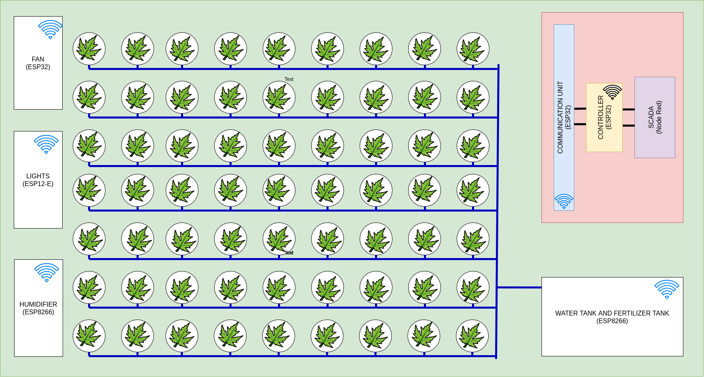
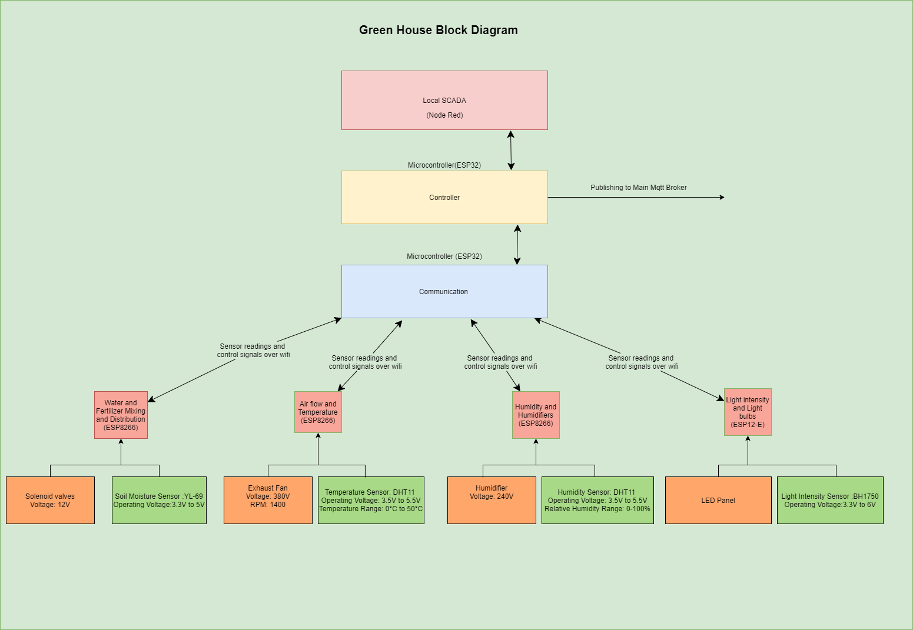

# Greenhouse Control System - Group 1

---

Our task was to implement a green house control system which is a part of the main project (Agriculture and Irrigation ontrol System).

---

**IMPORTANT**

This contain submodules. Run `git submodule update --init` after cloning the repo.

---

## Team Members

- Harshana Bandara (E/16/049)
- Sathira Basnayake (E/16/054)
- Kavindu Chamith (E/16/057)
- Shirly Madushanka (E/16/094)
- Yasitha Herath (E/16/134) - Team Leader
- Buddhi Perera (E/16/276)
- Madusha Shanaka (E/16/351)
- Thushara Weerasundara (E/16/388)
- Nadun Welikanda (E/16/389)

---

## [Presentation Slides](https://docs.google.com/presentation/d/1CrzfinPTvfY6xp6GnqOgqTrK0Q-bVMoASOR2lsSOK78/edit?usp=sharing)

---

## The Big Picture

---

## Block Diagram

---

## Task Allocation

| Team Member                      | Task                                                        |
| -------------------------------- | ----------------------------------------------------------- |
| Harshana Bandara (E/16/049)      | Soil moisture, Water and fertilizer tank                    |
| Sathira Basnayake (E/16/054)     | Light intensity                                             |
| Kavindu Chamith (E/16/057)       | Local Scada                                                 |
| Shirly Madushanka (E/16/094)     | Communication with the main station                         |
| Yasitha Herath (E/16/134)        | Soil moisture, Water and fertilizer tank                    |
| Buddhi Perera (E/16/276)         | Control Logic                                               |
| Madusha Shanaka (E/16/351)       | Humidity and humidifier                                     |
| Thushara Weerasundara (E/16/388) | Temperature and fan                                         |
| Nadun Welikanda (E/16/389)       | Coomunication with the sensor/actuator nodes and controller |
