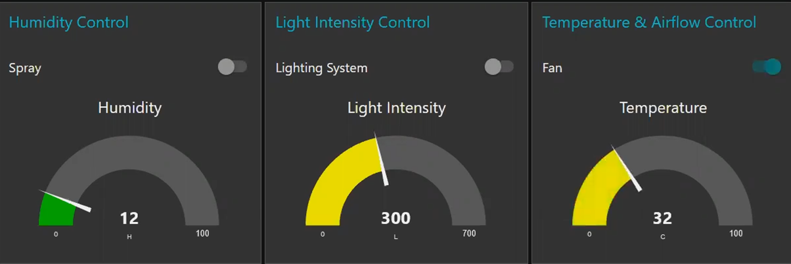

## 1. Import the _.json_ files into Node-RED control panel

## 2. Install node-red-dashboard
`npm install node-red-dashboard`

## 4. Deploy the application

## 5. Access the UI via 
`http://localhost:1880/ui`

